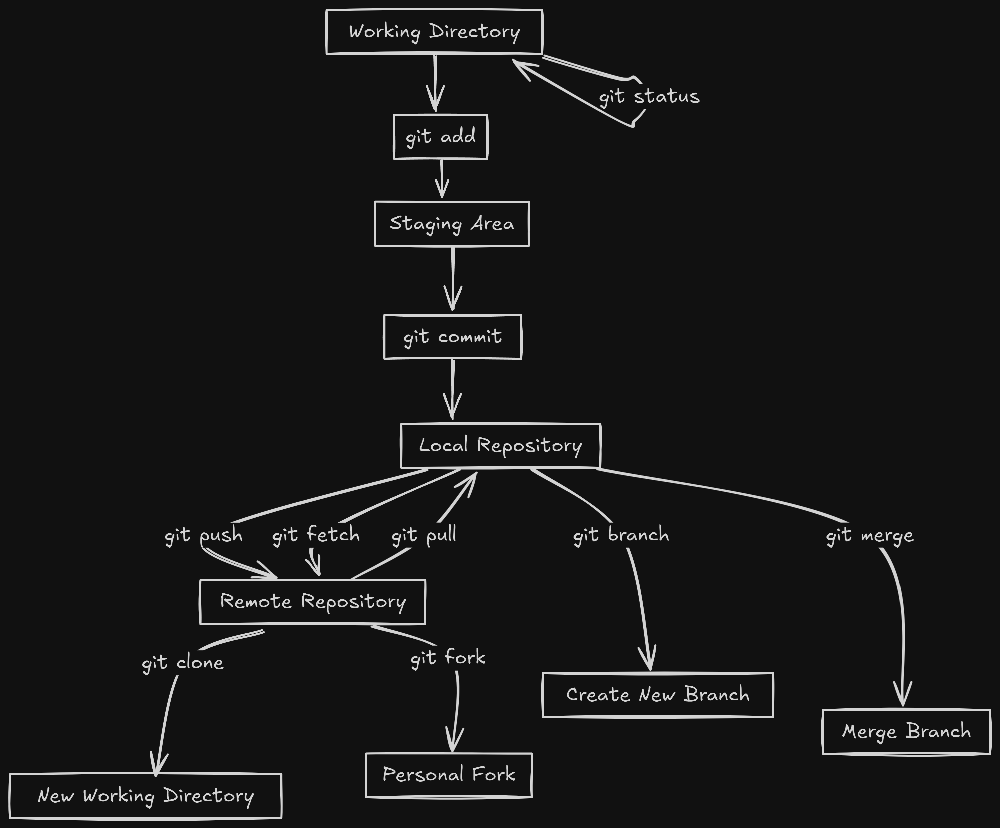

# Introduction to Git and Git Cheat Sheet

git is a powerfull tool for version control. It is used to track changes in the
source code. It is used to coordinate work among programmers collaboratively
developing source code during software development. It is a distributed version
control system. It is designed to handle everything from small to very large
projects with speed and efficiency.

understanding in simple language Git provide a way to collabrate and manage code
as well as track changes in the code. It is a tool that helps you to keep track
of the changes in your code.

## understanding git features

The following is the overall structure of the git. 

### working Directory

    the working Directory is nothing but a folder on your local machine where you are working on your project. It is the place where you are making changes to your code.

- `git init` : This command is used to initialize a new git repository. It
  creates a new subdirectory named .git that contains all of your necessary
  repository files.
- `git status` : This command is used to check the status of the working
  directory. It shows the changes that are not staged for commit.

### Git add

    The git add command adds a change in the working directory to the staging area. It tells Git that you want to include updates to a particular file in the next commit.

    - `git add` : This command is used to add changes to the staging area. It tells git that you want to include updates to a particular file in the next commit.

    example:

    `git add file.txt` : This command is used to add file.txt to the staging area.
    `git add .` : This command is used to add all the files to the staging area.

### Git staging area

    The staging area is a place where you can group changes before committing them to the repository. It is also known as the index. It is a place where you can add changes to the repository.

### Git commit

    The git commit command is used to save the changes to the local repository. It is used to save the changes to the local repository. It is used to save the changes to the local repository.

    - `git commit` : This command is used to commit the changes to the repository. It is used to save the changes to the local repository.

    example:
    `git commit` : This command is used to commit the changes to the repository.

    `git commit -m "message"` : This command is used to commit the changes to the repository with a message.
    `git commit -am "message"` : This command is used to add and commit the changes to the repository with a message.

### Git Branch

    A branch is a lightweight movable pointer to one of the commits. The default branch name in Git is master. It is a pointer to the last commit made in the repository.

    - `git branch` : This command is used to list all the branches in the repository.
    - `git branch branch_name` : This command is used to create a new branch.
    - `git branch -d branch_name` : This command is used to delete a branch.
    - `git branch -m branch_name new_branch_name` : This command is used to rename a branch.

    example:
    `git branch` : This command is used to list all the branches in the repository.
    `git branch branch_name` : This command is used to create a new branch.
    `git branch -d branch_name` : This command is used to delete a branch.
    `git branch -m branch_name new_branch_name` : This command is used to rename a branch.

    
